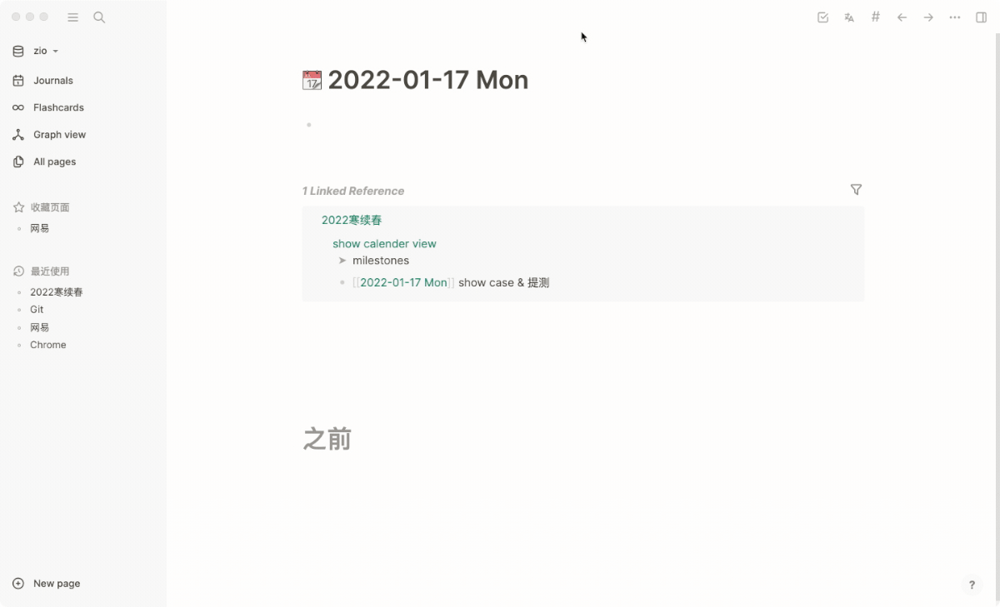

# logseq-plugin-milestone
> show milestone in calendar

[](https://github.com/haydenull/logseq-plugin-milestone/releases)
[](https://github.com/haydenull/logseq-plugin-markdown-table/blob/main/LICENSE)

English | [简体中文](./README-zh_CN.md)

## Demo


## Usage
1. Install plugin
2. Fill in the plugin configuration, **must fill in `dateFormatter`**
3. Input `/` command, select `milestone`
4. In milestones' sub-nodes, input time node

## Plugin configuration
- dateFormatter: Refer to [moment](https://momentjs.com/docs/#/displaying/) fill in time format string, must match your notes' time format

## Configuration example
```json
{
  "dateFormatter": "YYYY-MM-DD ddd"
}